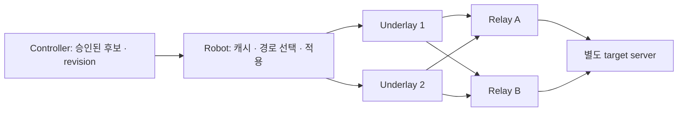

# M3 경로 제어 계약과 초기 dataplane 결정 (#21/#22/#23/#24/#98)

상태: **catalog/binding v1과 node key/cache 구현, dataplane·자동 전환은 후속 단계**.
[관리 CLI·인증 API·운영 제한](relay-catalog.md)은 #103의 구현 범위다.
[후보 cache와 경로 키](node-relay-cache.md)는 #105의 구현 범위다.
OS 적용, 자동 선택·전환 계약은 아직 구현 준비 상태다.
`TestNetns_M3PathTopology`는 정적 후보와 시험기가 명시적으로 선택한 경로를 검증한다.

## 목적과 경계

로봇이 서버 uplink에 도달할 수 있는 `(underlay, relay, target)` 경로를 선택·복구한다.
로봇의 작업·움직임을 제어하지 않는다. LTE가 없는 로봇도 Wi-Fi/Ethernet으로 relay에
도달할 수 있으면 VPN을 사용한다. 이용 가능한 물리 경로가 모두 없으면 `no_uplink`다.
controller는 identity/승인/설정 발행, relay는 패킷 전달, node는 로컬 경로 적용을 맡는다.
controller와 relay는 같은 호스트에 배치할 수 있지만 장애 상태와 관측 identity는 분리한다.

## 초기 결정: 후보 경로별 WG interface와 명시적 목적지 route

동일한 target prefix를 가진 후보들은 **서로 다른 WG interface**에 둔다. 한 interface의
중복 AllowedIPs를 여러 peer에 맡겨 경로 선택을 표현하지 않는다. 각 `(relay, underlay)`
후보는 별도 interface, 전송 mark와 route table, WG key/IP binding을 가진다. target별
active 경로는 하나다. 초기 범위는 IPv4·관리되는 kernel WireGuard·명시적 target prefix다.
ECMP, IPv6, arbitrary default tunnel과 다른 관리자가 소유한 WG interface의 자동 개조는
후속 계약을 먼저 정의해야 한다.

WireGuard의 fwmark는 암호화 UDP 전송에 사용할 수 있다. namespace에서 생성한 WG는
이동 후에도 생성 namespace의 UDP socket을 사용한다. 따라서 앱의 WG 경로 선택과
암호화 패킷의 물리 경로 선택은 각각 검증해야 한다.
[WireGuard 공식 routing/namespace 설명](https://www.wireguard.com/netns/).
이 문서의 후보별 interface/mark 선택은 그 기능을 이용한 프로젝트 설계 결정이다.

| 대안 | 장점 | 비용·실패 특성 | 초기 선택 |
| --- | --- | --- | --- |
| 한 WG interface의 peer를 교체 | interface 수 적음 | 후보 병행 탐사·기존 peer rollback·controller peer 공유에 결합 발생 | 보류 |
| 후보별 WG interface + mark/table | 후보 독립 탐사·명시적 경로·영향 범위 확인 | key/IP/route 자원 증가, cleanup 필요 | 채택 |
| underlay별 socket 생성 namespace | 강한 전송 격리 | NetworkManager/modem/DNS와 namespace 소유권 통합 필요 | 배포 요구가 있을 때 확장 |

node당 후보는 초기 계약에서 최대 8개, relay 최대 4개, underlay 최대 4개로 제한한다.
직교 조합을 자동 생성하지 않고 controller가 승인한 명시적 조합만 설치한다. 이 수치는
초기 자원 한도이며 32-node 부하/SLO 검증 후 확정할 운영 보장은 아니다.

## 발행 계약

다음 표는 M3 전체 구현의 목표 계약이다. `GET /relay-catalog`와 경로 binding v1의
실제 필드·지원 범위는 [구현 문서](relay-catalog.md)를 따른다. 영속 cache는 동일 세대 내용
변경을 거절한다. policy와 키 교체 전환 확인은 후속 단계다. 기존 `/wg-config`는 단일 relay
동작을 유지하며 새 catalog만 발행해도 OS 경로가 바뀌지는 않는다.

| 필드 | 불변 조건 |
| --- | --- |
| `schema_version`, `generation`, `issued_at`, `expires_at` | 지원 버전만 수락, 세대 단조 증가, 동일 세대의 상이한 내용 거절 |
| `controller_identity`, `node_id` | 인증된 controller와 해당 node에 묶인 응답; 다른 node의 후보/키 설치 거절 |
| `relay.id`, `site`, `public_key`, `key_generation` | 이름 재사용으로 키 변경을 숨기지 않음. 승인된 키 교체의 이전·새 세대와 폐기 시점 명시 |
| `relay.endpoints[]` | protocol=WG/UDP, 검증된 주소/port, 사용 가능한 underlay ID 명시. DNS 변경은 별도 검증·revision 후 반영 |
| `path.id`, `relay_id`, `underlay_id`, `target_ids` | `(node, relay, underlay, key generation, target)` 관계를 안정적인 ID로 연결 |
| `inner_address`, `allowed_prefixes` | IPAM 예약 및 node binding 필수. 초기 경로별 내부 주소로 반환 경로 모호성을 피함 |
| `priority`, `cost`, `drain`, `disabled` | 정책 입력. drain은 새 선택 금지 후 전환·기존 flow 처리 완료를 확인하고 제거 |
| `target.id`, `address_prefixes`, `protocol`, `ports` | 실제 앱 도달성을 검사할 목적지. WG handshake 성공으로 target 성공을 대신하지 않음 |
| `policy.mode`, `manual_pin`, `minimum_quality`, `hold_down`, `minimum_dwell` | default/manual/auto 구분. 시간·품질 threshold는 버전이 있는 정책 값이며 임의 상수로 숨기지 않음 |

비밀키는 공개 catalog에 싣지 않는다. node가 경로별 키를 생성하고 인증된 API에서 public
key binding을 승인받는 절차가 필요하다. 반환 경로·SNAT의 소유권은 relay 배포 저장소에
있다. descriptor 수락만으로 OS forwarding이나 server route가 준비됐다고 판단하지 않는다.

## 적용·캐시·실패 처리

1. **Validate:** 인증, revision/유효시간, key/주소 binding, 충돌하는 prefix 및 소유 자원 확인.
   중복·누락·과다 후보를 전체 거절하고 현재 승인 상태를 유지한다.
2. **Prepare:** inactive 후보의 WG/route/전송 pin을 생성하고 해당 후보로 강제한 target
   probe로 검증한다. 아직 앱 트래픽을 바꾸지 않는다.
3. **Select:** 수동 pin → 금지/비용 제약 → 관측 유효성 → 건강한 후보의 우선순위 순서로
   판단한다. pin 후보가 죽었을 때 다른 경로로 자동 이동할지는 별도 명시 정책이다.
   기본 manual mode는 pin을 우회하지 않고 실패를 보고한다.
4. **Apply:** target route 한 개의 replace와 커널 readback을 수행한다. 여러 route/rule의
   변경 전체가 트랜잭션이라고 주장하지 않는다. 실패하면 소유한 변경만 journal로 복구하고
   last-known-good 또는 명시적 no_uplink를 남긴다. 다른 프로세스의 자원을 덮어쓰지 않는다.
5. **Confirm:** 새 경로의 실제 target probe 성공을 확인한 후 전환 완료를 기록한다.
   detection/decision/apply/first-success 시각을 별도로 남긴다.
6. **Persist/reconcile:** 승인 catalog와 적용 journal을 원자적으로 저장한다. 재시작하면
   journal과 커널 상태를 대조하고, 확인되지 않은 경로를 healthy로 표기하지 않는다.
   link-down으로 device에 묶인 정책 route가 삭제될 수 있다. link-up/address 변경 뒤에는
   해당 underlay를 쓰는 **모든 소유 후보 table**을 복구하고 readback/target probe를
   통과해야 healthy로 복귀한다. 링크 상태만 보고 복구를 선언하지 않는다.

controller outage 중에는 유효기간 내 cached 후보와 로컬 관측만으로 전환할 수 있어야 한다.
유효기간이 지난 catalog로 새 후보를 설치·선택하지 않는다. 이미 적용된 경로의 유지 기간,
유효기간 만료 뒤 차단/유지 정책 및 운영자의 명시적 연장 절차는 구현 전에 확정한다.
폐기 정보를 받을 수 없는 offline node에 즉시 전역 revocation을 보장하지 않는다.
controller API 성공과 application uplink 성공은 각각 기록한다.

암호화 전송 mark의 table에는 선택 underlay로 가는 endpoint route와 종결
`unreachable default`를 함께 둔다. endpoint route가 삭제될 때 다음 rule/main table로
빠지는 일을 막는다. 전송 source/address 변경은 candidate 재검증을 요구한다.
reply 경로와 reverse-path filter는 배포 계약에 포함한다. `rp_filter`와 `src_valid_mark`의
관계는 [Linux kernel IP sysctl 문서](https://docs.kernel.org/networking/ip-sysctl.html)를 따른다.
운영 호스트의 필터를 일괄 비활성화하지 않는다.

## 반환 경로와 연결의 의미

초기 fixture는 path별 inner address와 relay별 scoped SNAT를 사용한다. 서버에서 관측한
source가 선택 relay의 uplink 주소와 일치해야 한다. relay/underlay 변경 시 source/NAT
상태가 달라질 수 있으므로 새 TCP 연결 복구와 기존 TCP 세션 유지는 별도 요구다.
연결 보존, UDP sequence 손실, bulk stream 중단을 #24에서 측정한다. 무중단 또는
stateful NAT failover를 이 정적 topology 결과로 주장하지 않는다.

## 구현 순서와 완료 gate

- #21: versioned relay catalog·등록/폐기·key/IPAM binding·cached 후보 → 관리 가능한 두 relay.
- #22: underlay inventory·source pin·주소/link/모뎀 변화·no_uplink → 실제 후보별 전송 검증.
- #23: bounded prepare/apply/rollback journal·manual/auto 정책·hold-down·재시작 reconcile.
- #24: controller 중단, relay/underlay 전환, NAT/return-path 오류, flap storm, TCP/UDP/bulk,
  가변 규모와 실제 장비 검증. p95는 이 matrix의 반복 표본으로 판단한다.

M2의 관측 의미와 인증서 검증 결함 조치는 병행한다. M3 준비 결과로 M2 완료를 선언하거나,
M2가 완료되지 않은 관측을 근거로 M3 자동 제어의 운영 합격을 선언하지 않는다.
