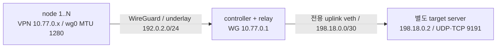

# 단일 relay에서 별도 uplink 서버까지의 sandbox 검증

추적: [#49](https://github.com/timo-kang/vpnctl/issues/49), M3 #24의 선행 검증.
M1 완료 당시에는 controller 노드에 있는 서버까지 검증했다. 이 변경은 실제로
relay가 패킷을 전달해야 하는 별도 목적지까지 검증 범위를 확장한다.

## 저장소 안에서 유지하는 이유

현재는 `tests/integration`과 `scripts/test-netns.sh`를 확장한다. kernel WireGuard,
실제 CLI/PKI, fault injection과 CI artifact를 이미 갖췄고 구현과 검증을 같은
커밋으로 재현할 수 있다. 노드 수나 relay 수 증가만으로 별도 저장소가 필요하지는 않다.
공통 실행/프로세스 수명 관리는 `network_helpers_test.go`, 단일 relay topology와
장애 시나리오는 `relay_uplink_test.go`, 트래픽 생성은 worker 파일로 구분한다.

여러 제품에서 공유하거나, 제품 릴리스와 별개로 유지하는 장시간 lab, VM/실장비
혼합 또는 여러 호스트 관리가 필요해지면 독립 도구를 검토한다.
[containerlab의 노드·링크 선언](https://containerlab.dev/manual/topo-def-file/) 같은
기존 도구를 평가한 뒤 분리한다. 현 단계에서 자체 범용 topology DSL을 만들지 않는다.

## topology와 격리



전체 lab은 `--network none`인 일회용 Docker 내부에 있다. server는 node의 underlay
bridge에 연결하지 않고, WG와 default route도 갖지 않는다. node도 default route와
인터넷 연결이 없다. server의 유일한 링크는 relay uplink이며, node의 목적지 route는
`wg0`를 사용해야 한다. relay의 forwarding chain은 기본 drop이며 지정한
WG ↔ uplink/목적지 주소의 양방향만 허용한다. API HTTPS는 계속 controller의 VPN
주소를 향하고 application UDP/TCP는 별도 서버를 향한다.

`NET_ADMIN`으로 컨테이너 내부 route/nft/conntrack을 변경한다. `SYS_ADMIN`은
namespace/mount 작업에 사용한다. Docker의 `/proc/sys`는 읽기 전용이므로 forwarding
설정 명령은 `ip netns exec`가 만든 별도 mount namespace에서 임시 proc을 mount한다.
그 namespace의 IPv4 forwarding만 변경하며 호스트 sysctl을 변경하지 않는다.
호스트 network/Docker socket/system directory를 mount하지 않고 `--privileged`를
사용하지 않는다. 이것은 테스트의 네트워크 격리이며 적대적 코드용 VM 보안 경계는 아니다.

## 두 배포 조건

1. **라우팅**: controller가 `server_allowed_ips`에 목적지 `/32`를 배포하고 node가
   WG 경로를 설치한다. relay의 IPv4 forwarding 및 필요한 firewall 통과 규칙을
   제공하고, target에 VPN subnet으로 돌아오는 relay 경유 route를 설정한다.
   target에서 관측한 source IP는 각 node의 VPN IP여야 한다.
2. **SNAT**: target의 VPN 반환 route를 제거한다. relay의 uplink에서 VPN subnet →
   지정 target 트래픽에만 SNAT를 적용한다. target에서 관측한 source는 relay의
   uplink IP다. NAT 규칙 제거 시 새 요청은 실패해야 한다. 모드 변경마다 relay
   namespace의 conntrack을 비워 이전 NAT 상태가 잘못된 성공을 만들지 못하게 한다.

이 조건들은 테스트와 운영자가 제공하는 네트워크 설정이다. vpnctl이 host firewall,
forwarding, NAT를 자동 구성하는 기능을 추가한 것은 아니다.
[Linux forwarding 설정](https://kernel.org/doc/html/latest/networking/ip-sysctl.html)을
포함한 배포 prerequisite 없이 관리 API 연결만으로 서버 uplink가 된다고 판단하면 안 된다.

## 시나리오와 완료 기준

기존 PKI matrix 전체의 application 목적지를 별도 서버로 변경했다. 1/3/8/32노드,
policy routing on/off, leaf 갱신·폐기·CA activate/rollback/retire, graceful/forced
controller 재시작, node의 WG 장치 삭제 후 복구와 underlay 손실을 유지한다.
UDP 20ms 주기/500ms 예산, 지속 TCP 50ms/500ms, HTTPS 100ms/1초 기준은 동일하다.
계획 구간의 실패·TCP 재연결은 0이어야 한다. 이 결과는 기존 controller 종단 측정
수치와 다른 topology의 결과이며 과거 실패를 소급 성공으로 바꾸지 않는다.

그 뒤 각 규모의 모든 node에서 다음 장애를 각각 세 차례 주입하고 해제한다.

| 장애 | application UDP/TCP | VPN 경유 controller API |
| --- | --- | --- |
| relay forwarding off | 실패 필수 | 성공 필수 |
| target의 VPN 반환 route 제거 | 실패 필수 | 성공 필수 |
| relay forwarding firewall drop | 실패 필수 | 성공 필수 |
| relay uplink link down | 실패 필수 | 성공 필수 |
| 반환 route 없는 SNAT 모드에서 NAT 규칙 제거 | 실패 필수 | 성공 필수 |

각 해제 뒤 재가입 없이 새 요청이 성공해야 한다. 검사 시작부터 worker 기동을 포함해
5초 안에 성공을 관측해야 하며, 개별 요청의 예산은 계속 500ms다. 이는 시험 기준으로,
현장 failover p95나 장기 연결의 NAT 전환 보장을 뜻하지 않는다. NAT 적용/제거도
세 번 반복한다. 요청은 UDP/TCP 각각 32/1,400바이트의 새 소켓을 사용한다.
실패로 기대한 구간에서도 payload 불일치나 설정 오류를 정상 장애로 처리하지 않는다.

### MTU 실험의 경계

최초 실행에서는 기본 UDP socket의 1,400바이트 첫 응답이 baseline과 반환 route
재설정 직후 유실됐다. 작은 UDP와 TCP는 성공했다. 기본 UDP는 PMTU 탐색을 수행하며
경로 MTU를 넘는 데이터그램에 대해 오류/최초 손실이 생길 수 있다.
[Linux UDP 문서](https://man7.org/linux/man-pages/man7/udp.7.html).
최초 실패 실행은 보존하며 무손실 검증 성공에 포함하지 않는다.

현재 1,400바이트 UDP 검사는 client와 echo fixture에서 명시적으로
`IP_PMTUDISC_DONT`를 설정해 IPv4 분할·재조립 경로를 검사한다. production socket이나
호스트 전역 MTU 정책은 변경하지 않는다. 기본 PMTU 탐색의 무손실, DF 패킷의 자동
크기 조정, 모든 NAT의 fragment 지원을 검증한 것으로 해석하지 않는다. 운영
애플리케이션은 경로 MTU에 맞는 UDP 크기 및 재전송 정책을 정해야 한다.

## 재현과 artifact

```sh
# 전체 기존 검증 + 별도 서버/단일 relay 장애 matrix
make test-netns

# 동일 기준의 2 CPU 배포 빌드
VPNCTL_RACE=0 VPNCTL_TEST_CPUS=2 \
VPNCTL_ARTIFACT_DIR=/tmp/vpnctl-relay-results \
./scripts/test-netns.sh -test.run '^TestNetns_PKILifecycleUplink$'

# 작은 규모를 먼저 확인
VPNCTL_NETNS_SIZES=1 ./scripts/test-netns.sh -test.run '^TestNetns_PKILifecycleUplink$'
```

CI는 기존 kernel 작업에서 이 시나리오를 필수 실행한다. `nodes-*` 결과 디렉터리에는
기존 `node-*.jsonl`, `summary.json`, `kernel.json`, 자원/HTTP 계측과 함께 다음이 남는다.

- `relay-<phase>-node-<n>.json`: 시각, protocol/payload, 성공·실패 종류·지연과 별도 API 결과.
- `relay-<phase>-topology.json`: relay/server 주소·route·forwarding 값, firewall/NAT counter,
  server에 WG 장치가 없다는 증거. 개인키와 token은 포함하지 않는다.
- `uplink-sources.jsonl`: target가 실제 관측한 protocol별 node VPN IP 및 SNAT IP.

다중 relay/통신망 전환, 실제 LTE/Wi-Fi/NAT 조합, IPv6, relay OS 전체 재부팅,
하드웨어·무선 채널의 재현과 현장 SLA는 별도 M3 검증에 남는다. controller 프로세스
재시작은 kernel relay 자체의 장애와 다르다. 물리 relay 장치가 꺼져도 통신을 유지하려면
대체 경로가 있어야 하며 이 단일 relay topology에서는 보장할 수 없다.

## 독립 운영과 배포 저장소 연계

외부 제품 바이너리 입력, suite/제품 digest, 실행 환경 기록, 권한과 artifact 계약은
[실행 계약 v1](../../tests/integration/README.md)에 둔다. 배포 환경이 소유하는
forwarding/firewall/서버 반환 route/SNAT는 [relay 배포 계약](../deployment/relay-network.md)에
따로 둔다. 배포 저장소는 필요한 계약 파일을 고정된 commit/tag에서 가져다 쓰고,
실제 환경별 적용·영속화·복원 책임을 가진다.
